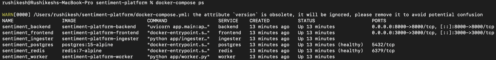
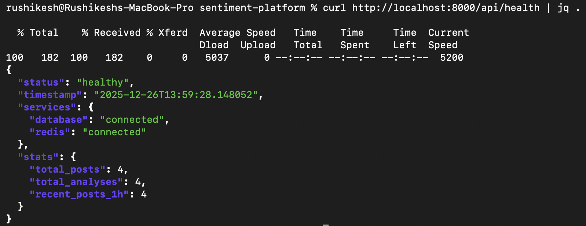
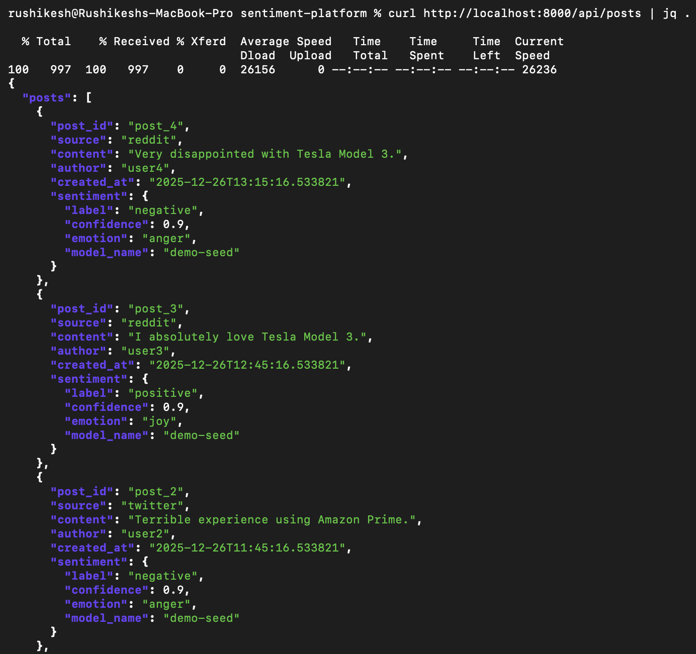
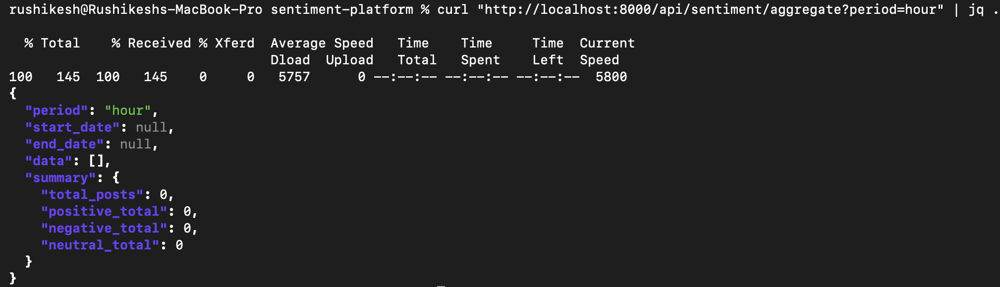
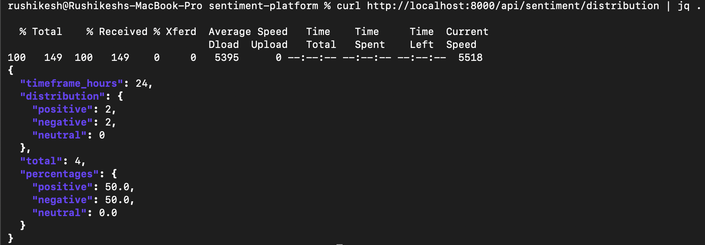
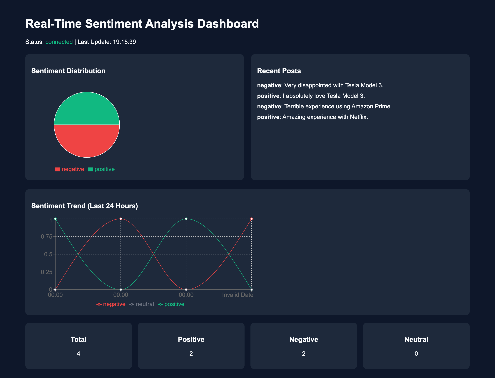
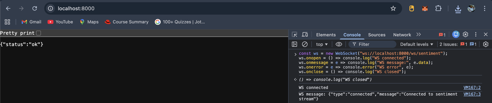

# Real-Time Sentiment Analysis Platform

## Overview
This project is a production-style, real-time sentiment analysis platform designed to process continuous streams of social media–like posts, analyze sentiment and emotions using AI models, and visualize insights through a live web dashboard.  

The goal of this project is not only to build a working application, but to demonstrate real-world engineering practices such as microservices architecture, asynchronous processing, message queues, containerization, and clean system documentation.

---

## Key Features
- Real-time ingestion of social media posts
- Sentiment classification (positive / negative / neutral)
- Emotion detection (joy, anger, sadness, fear, surprise, neutral)
- Redis Streams–based message queue for reliable processing
- Asynchronous background worker for AI inference
- PostgreSQL for durable storage and analytics
- REST APIs for historical and aggregated data
- WebSocket support for live dashboard updates
- Fully Dockerized, zero-configuration startup using Docker Compose

---

## Technology Stack
- **Backend API**: FastAPI (Python)
- **Worker Service**: Python (async, background processing)
- **Message Queue**: Redis 7 (Redis Streams)
- **Database**: PostgreSQL 15
- **Frontend**: React 18 with Vite
- **AI Models**:
  - Hugging Face Transformers (local inference)
  - Optional external LLM support via environment configuration
- **Containerization**: Docker & Docker Compose

---

## System Architecture
The platform is composed of exactly six containerized services:

1. PostgreSQL (database)
2. Redis (message queue and caching)
3. Ingester (data producer)
4. Worker (AI processing)
5. Backend API (REST + WebSocket)
6. Frontend Dashboard (React)

A detailed architectural explanation is provided in `ARCHITECTURE.md`.

---

## Prerequisites
- Docker 20.10+
- Docker Compose v2+
- Minimum 4 GB RAM
- Ports **3000** and **8000** available

---

## Quick Start

```bash
# Clone the repository
git clone https://github.com/Rushikesh-5706/real-time-sentiment-analysis-platform.git
cd sentiment-platform

# Create environment file
cp .env.example .env

# Start all services
docker-compose up -d

# Verify services
docker-compose ps
```

Access the application:
- Frontend Dashboard: http://localhost:3000
- Backend API Health Check: http://localhost:8000/api/health

---

## API Endpoints (Summary)
- `GET /api/health` – System health status
- `GET /api/posts` – Paginated list of analyzed posts
- `GET /api/sentiment/aggregate` – Time-based sentiment aggregation
- `GET /api/sentiment/distribution` – Sentiment distribution summary
- `WS /ws/sentiment` – Real-time sentiment updates

---

## Project Structure (High Level)

```
sentiment-platform/
├── docker-compose.yml
├── .env.example
├── README.md
├── ARCHITECTURE.md
├── backend/
├── worker/
├── ingester/
└── frontend/
```

---


## 📸 Execution Proof & Screenshots

### Docker Services Running


### Backend Health Check


### Posts API


### Sentiment Aggregation API


### Sentiment Distribution API


### Frontend Dashboard


### WebSocket Connection


---


## Testing
Backend tests are written using `pytest`.

Run tests:
```bash
docker-compose exec backend pytest -v
```

Run coverage:
```bash
docker-compose exec backend pytest --cov=app --cov-report=term
```

---

## Notes on Evaluation
- The system auto-initializes on startup (no manual DB setup).
- Redis Streams ensure at-least-once message delivery.
- AI models are pre-trained and used directly (no retraining required).
- Dashboard rendering is validated even with minimal or seeded data.

---

## License
This project is intended for educational and evaluation purposes.
